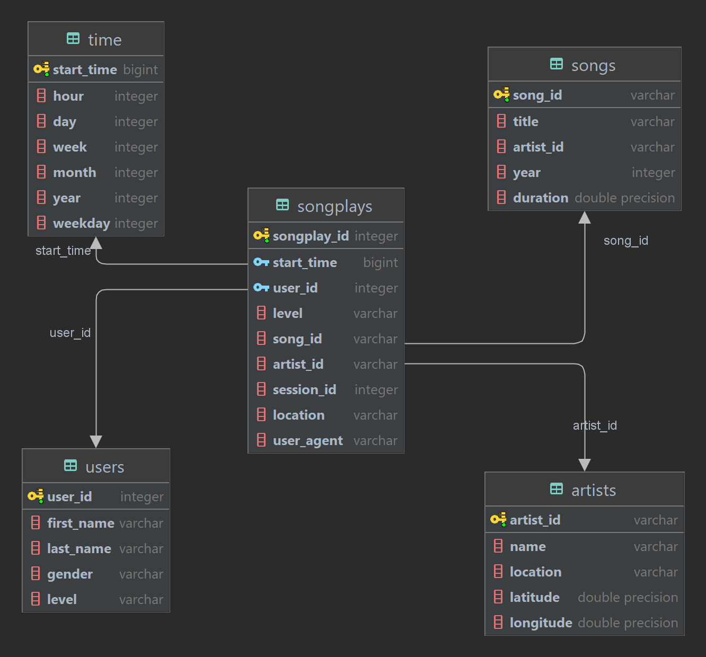

# 1. Discuss the purpose of this database in the context of the startup, Sparkify, and their analytical goals.

The purpose of this database is to get the analytical data about music and their related information to get to know more about their artists and users such as:
- Which song is played the most?
- The artist that has the song which is played the most. This metric can be used to award that artist.
- Collection of songs that are played the most for a user for each year.
- How many paid and free users?
- How many users? The ratio of male and female users?

# 2. State and justify your database schema design and ETL pipeline.

## 2.1 Schema design

The schema design is followed by the guide in project instructions, including 1 fact table and 4 dimension tables and have the schema like below:

## 2.2 ETL pipeline

1. Run create_table.py to drop exists db and create a new one with schema design imported from sql_queries.py.
2. Connect to db using `psycopg2` lib and get the cursor.
3. Read through each file path in data/song_data path, each path do the following steps:

    a. read json content from file with specified path `filepath` and load to `df`.

    b. Get song id, title, artist id, year and duration of the first row in song data json (because each file only contains only 1 song), transform to list, and assign `song_data` variable.

    c. Insert data about song into songs table.

    d. Get artist id, name, location, latitude and longitude, transform to list and assign to `artist_data` variable.

    e. Insert data about artist into artists table.
4. Read through each file path in data/log_data path, each path do the following steps:

    a. read json content from file with specified path `filepath` and load to `df`.

    b. Get song play detail by filtering `NextSong` value in `page` column and assign back to `df`.

    c. Convert timestamp column `ts` in `df` to datetime and load to variable `t`.

    d. Get value for each attribute in datetime (hour, day, week, month, year, weekday), convert to list using `values()` function and use `zip()` function to combine all lists and assign to `time_data`.

    e. Create labels for columns and assign to `column_labels`.

    f. Use DataFrame to create a new data frame for `time_data` with columns `column_labels` and assign to `time_df`.

    g. Loop through `time_df` and insert values in each row into `time` table.

    h. Loop through `df`, get detail about song id and artist name for that song play, create tuple `songplay_data` with timestamp, user id, level, song id, artist id, session id, location and user agent and insert into `songplays` table.
5. Close connection.

# 3. [Optional] Provide example queries and results for song play analysis.

- Which song is played the most: `select song_id, count(*) total_played from songplays group by song_id order by total_played desc;`
- The artist that has the song which is played the most: `select artist_id, song_id, count(*) total_played from songplays group by song_id, artist_id order by total_played desc;`